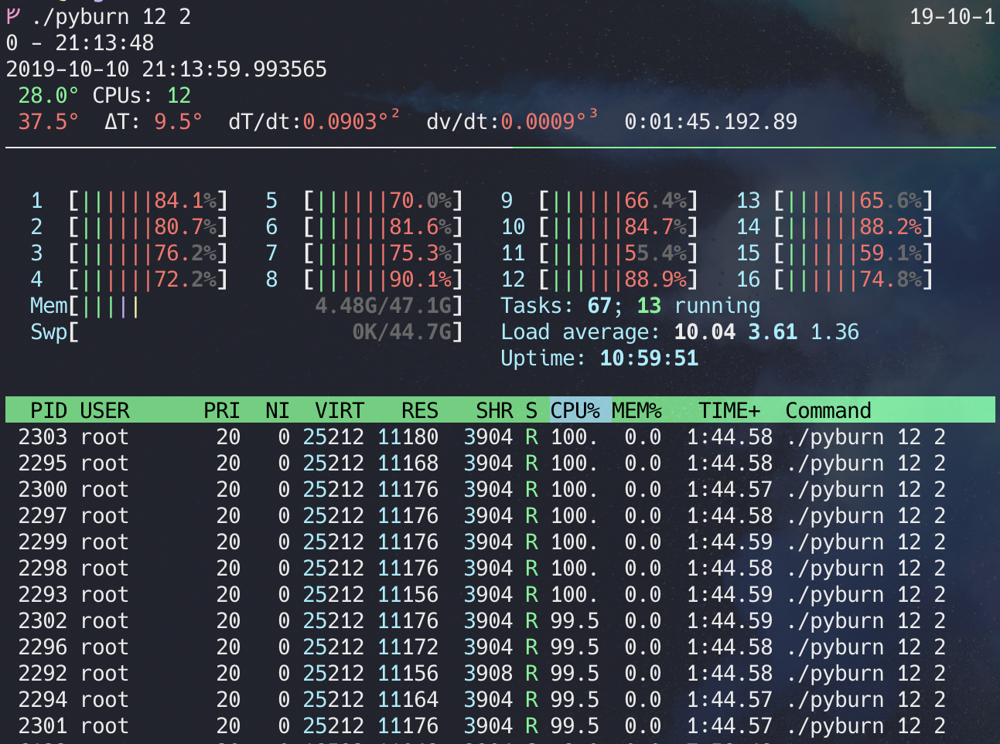
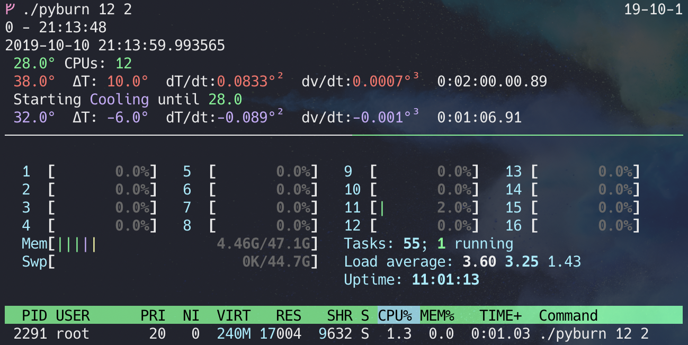

# Pyburn

I wrote this to test the cooling capabilility of my pc. 
Pass in the number of CPUs you and to burn and how long.



**Here is it burning CPUs**



**Here is it cooling off**


### Usage

#### Python3:
```bash
python3 ./source/pyburn.py [n_cpu] [minutes]
```

#### Standalone Binary:

```bash
./bin/pyburn [n_cpu] [minutes]

```


#### Todo

* Use argparse instead of sys.argv
* NumPy/Matplotlib plot terminal output.
* Cupy integration?
